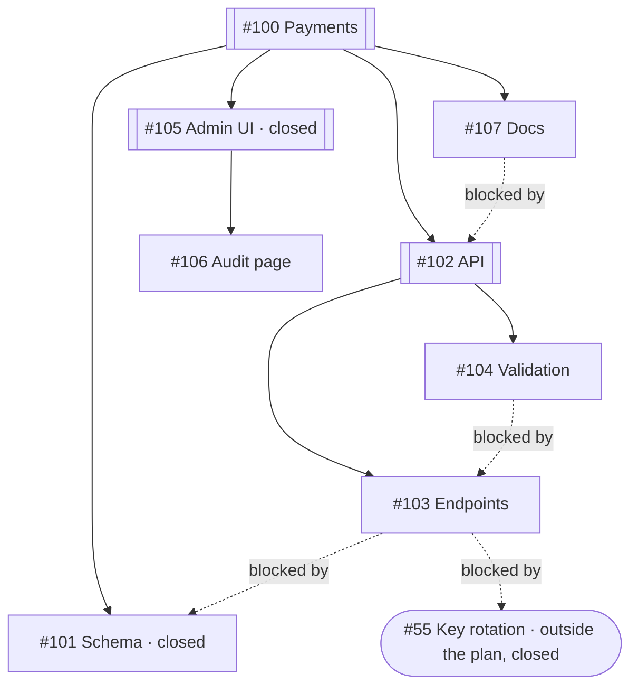

# ADR: A feature is a build made of builds

- **Status:** Accepted
- **Date:** 2026-08-19
- **Source:** Design conversation (Cowork), August 2026

## Context

The build-from-chat slice gave the persona one verb: `start_build(prompt,
repository, branch, base?)`. One prompt, one branch, one Agent, one worktree,
one run record. GitHub is uninvolved.

The next thing Epik must do is the thing Epik is for: take a *feature* — a
GitHub issue with child issues beneath it, some of which wait on others — and
build the whole set, running as much of it at once as the dependencies allow.
GitHub records the child edges as sub-issues and the ordering edges as
blocked-by, both under the Relationships field on an issue.

The shape of this is not new to the project. The GitHub Actions engine did it,
and `local-client-greenfield` ported it into Rust: `run/feature.rs` reads the
sub-issue graph, ensures the feature branch, and folds blocked-by edges into a
ready set with `ready()`; `run/issue.rs` walks one issue to a verdict. Those
semantics are validated by real builds and are what this design ports. The
*code* is not what is ported: it was written against the Actions-shaped
`CodingAgent`/`Task`/`Budget` vocabulary that the 2026-08-15 restart
deliberately de-generalized, and it schedules in sequential rounds, which is the
one property we are here to change.

## Vocabulary

Design-driven: an architectural element carries the same name in source that it
carries in conversation. A bare name may be underspecified so long as the
fully-qualified path reads — `epik::build::Order` is interpretable where `Order`
alone is not. The corollary is that stuttering modules are the real fault, and
that a name legible only when qualified must never be re-exported at the crate
root.

| We say | Source |
|---|---|
| Feature | `epik::feature`, the module |
| Plan | `epik::feature::Plan` |
| Issue | `epik::feature::Issue`, `IssueId` |
| Build (of a feature) | `epik::feature::Build`, `epik::feature::build` |
| Tracker | `epik::tracker::Tracker` |
| Forge | `epik::forge::Forge` |
| Check | `epik::check::Check`, `detect`, `run` |

`Build` rather than `Conduct` because "build feature 144" is what gets said out
loud; conduct was greenfield's word and never anyone's speech. It also states
something true that conduct obscured — a feature build *is* a build, one storey
up, and `feature::Build` holds many `build::Run`s.

**"The harness" is retired.** It named a side of a boundary rather than a
component, and under this rule that makes it a phantom with no referent — the
kind of word that gets someone writing a `Harness` struct six weeks later
because the prose implied one. Every sentence that used it has a real actor
underneath: the build, or provisioning, or Epik. `build.rs`'s module doc
currently ships *the harness observes; the Agent commits*; it should read *Epik
observes; the Agent commits*.

Two collisions kept knowingly. `feature::Issue` and `github::Issue` are the
domain type and the wire type of one idea, each correctly named in its own
module. And "the persona" has no type and should not: it is a character made of
a system prompt and a registry, said only of behaviour and never of a mechanism,
which is precisely what distinguishes it from the harness.

One deliberate exception to one-name-everywhere: **names in a tool schema answer
to the model's vocabulary, not ours.** `Order.prompt` and the `start_build`
argument stay `prompt` because models have a trained sense of that word and
there is nothing to gain from fighting it; the assembled thing an Agent receives
stays `Brief`, since prompt is already the name of one of its ingredients.

## Decisions

### A feature is built; only an issue is implemented

`implementation.rs` on `main` makes `Feature<I>` an `Implementable`, whose
`implement(&self, source, dest, log) -> Result<()>` is blocking and returns unit.
Greenfield's implementation of it is `bfs` into a `for` loop, which is the only
thing that signature can express. Concurrency cannot be added to it without
hiding a scheduler inside a blocking call, and start-and-return — which the chat
surface requires, because a tool handler runs inside the turn lock — cannot be
expressed at all.

So `Feature<I>: Implementable` is dropped. `Implementable` describes a single
issue: a prompt, a worktree, an Agent, an observation. `feature::build` is the
layer above: it owns the plan, the ready set, the slots, the merges, and one
shared record. The recursion reads beautifully and costs the feature we are
building.

`Tree<T>`, `Endpoint`, and `Branch` are kept as they stand.

### Containment is a tree; order is a DAG over the same nodes

Sub-issue edges nest — a feature may hold sub-features, for readability, as noted
since the first build. Blocked-by edges do not nest; they cross the tree freely
and form a DAG. One structure cannot carry both without lying about one of them.

A `Plan` is therefore a `Tree<Issue>` rooted at the feature issue, plus a flat
list of blocked-by edges over the same node ids, plus whatever blockers point
outside. Scheduling is a pure fold over the flattened node set and the edges.
Rendering — which is what makes nesting worth having — reads the tree.

Interior nodes are containers, not work. A node with children is settled when all
its descendants are settled; only leaves get an Agent. The common feature, one
level deep, is entirely leaves, and the rule costs nothing there.

By an earlier convention only the root was allowed children. GitHub does not
enforce that and neither will we: any issue may hold sub-issues, which is the
reality rather than a feature. The worst case looks like this — solid edges are
containment, dashed edges point from an issue to what blocks it, exactly as
`Blocking { issue, blocker }` reads.



In prose, for surfaces that do not render Mermaid: #100 contains #101, #102,
#105 and #107; #102 contains #103 and #104; #105 contains #106. #103 is blocked
by #101 and by #55; #104 is blocked by #103; #107 is blocked by #102. #101,
#105 and #55 are closed.

The only ready issue is **#103**, and every rule in this design does visible
work to get there:

- **#101** is closed, so it is settled and not work to be done.
- **#103** is a leaf; its blockers are #101 (closed) and #55 (closed, and
  outside the tree entirely — an edge may leave the plan, and its far end is
  judged by its own state). Neither ancestor is settled. Ready.
- **#104** waits on #103, which has not landed. Not ready.
- **#107** is blocked by #102 — a *container*. It becomes ready when #103 and
  #104 have both landed, because a container's settledness is its children's.
  This is why blocked-by edges must be allowed to point at containers: "the docs
  wait on the whole API" is the natural thing to say.
- **#106** is open, unblocked, and still not ready, because its parent #105 is
  closed. Someone abandoned that sub-feature, and the subtree beneath it goes
  with it.

### One predicate, one primitive

Sub-issue semantics could easily end up restated in five places — the descent
that builds the tree, the leaf selection, the container rule, failure
propagation to a subtree, and the status rendering. It is stated once:

```
settled(id) = done.contains(id)
           || closed_in_tracker(id)
           || (has_children(id) && children(id).all(settled))
```

Everything else calls it. `ready` is the leaves where `settled` is false for the
leaf and for all its ancestors, and true for all its blockers — the same
predicate applied three ways. The abandoned subtree above needs no rule of its
own; it is the ancestor clause.

Navigation is likewise one function. `Tree::find_path` returns the chain of
subtrees from the root to a match, and from that one result come the node, its
subtree, its descendants and its ancestors. Failure propagation is then a query
rather than a rule, and nothing outside `tree.rs` walks `children` by hand.

Epik never asserts a container's state. It closes the leaves it built; a
parent's doneness is derived and never written back, because the moment Epik
closes a container that node has two sources of truth that can disagree. GitHub
does not auto-close parents either, which is the same judgement arrived at
independently.

### Two seams: a Tracker and a Forge

GitHub is two systems wearing one hat. Issues, sub-issue edges, blocked-by edges,
comments, closing — that is a tracker, and it is the part Linear or Jira would
implement. Branches, pushes, pull requests, check runs — that is a git forge, and
it stays git hosting.

Greenfield's `Machinery`/`Evidence` traits mixed both behind one seam, so a
Linear adopter would have had to answer for `create_branch` and `open_pull`.
Cutting the seam along the real fault line means a second tracker implements
issue verbs only.

`Tracker` lands first, because reading the plan is the first thing to build.
`Forge` lands with the branch work and is thin by design in this slice — the
remote to push to and the credentials to push with — growing pull-request and
check verbs only when the review conversation arrives. A thin trait that names
the right boundary is better than a fat one that names the wrong boundary.

### The build merges; the Agent never touches the feature branch

The build preamble already tells the Agent not to push, not to create or switch
branches, and not to touch git configuration. That holds. Each issue gets its own
branch, cut from the feature branch's tip *at dispatch time*, in its own
workspace. When the Agent is reaped and the observation is good, `feature::merge`
brings that branch into the feature branch with `--no-ff`, in the feature
workspace the build keeps for itself, under a lock, one merge at a time.

Merging is deterministic plumbing, which is exactly the class of work that gets a
tool rather than a model. Cutting each issue's branch from the current tip rather
than a fixed base also means every issue that starts late already contains
everything that landed early — the cheapest conflict reduction available, and
free.

### A merge conflict fails that issue, and nothing resolves it

Two siblings ready at the same moment branch from the same tip; the second to
finish merges into a branch that moved under it. For a diamond that is the normal
case, not an edge case.

On conflict the build runs `git merge --abort`, marks the issue failed with the
conflicting paths in its report, and leaves the issue branch intact. Issues
downstream of a failed issue are marked skipped — they are blocked forever — and
the build finishes with the rest.

No rebase, no retry, no second Agent invocation to resolve. This is the same
posture already taken on the commit contract: build the remediation against a
real corpse, not against a hypothesis about what the corpses will look like.

### Every commit on the feature branch is green

An issue is not done because its Agent said so. After the merge succeeds, still
holding the merge lock, the build runs the repository's own check in the feature
workspace. Exit code zero keeps the merge and pushes. Anything else resets the
feature branch to the commit it stood on before the merge, and the issue is
failed with the check's output as its report.

After the merge, not before, and that is the whole point. A pre-merge check in
the issue's own workspace catches only an Agent that lied. A post-merge check
catches that *and* the semantic conflict — two siblings that each build alone and
do not build together, which git merges without a murmur because the textual
edits never overlapped. With four Agents cut from the same tip, that is not a
corner case; it is the thing that will happen.

The cost is named: the merge lock is held for the duration of a check, so merges
queue behind one another. That is what a merge queue is, and it is the price of
the invariant.

**The check is a precondition, not an instruction.** A feature build refuses to
start until it holds a `Check` or an explicit skip. It raises the question itself
as its first act; the persona never decides whether to ask, and the command never
appears in a prompt. A step that must always happen is not a step you write into
a prompt and hope for.

The brief still tells the Agent to write tests covering its work and make them
pass. Instruction and gate are different things and both are worth having: the
instruction costs nothing and produces better Agents; the gate is what makes the
instruction more than a wish.

### Green is whatever the repository says green is

`Check` holds a string. `check::run` executes it in the feature workspace through
`sh -c` — real check commands are pipelines — and reads the exit code. Epik has
no opinion about what the command is. A shell there is not the weak link; a
coding Agent with `--dangerously-skip-permissions` is already running in that
same worktree.

Where the string comes from: `check::detect` is a fixed table over markers in the
worktree — `package.json` with a test script, `go.mod`, `pyproject.toml`,
`pom.xml`, a `Makefile` with a test target, `Cargo.toml` — proposing a command
that a question card confirms. Detection **prefills**; it does not decide. A
project whose real truth is `./manage.py test && ruff check .`, or a script
called `bin/ci`, is one edit of a filled field. Epik's own repository is the
worked example of why: `cargo test --workspace` misses `epik-frontend` entirely,
because it is outside the workspace on the wasm target, and misses both clippy
passes; the truth is `.githooks/pre-commit`.

A repository matching no arm opens the card empty. Skipping is a first-class
answer, at the user's stated risk: the build runs on observation alone, the
record says the branch is unchecked, and Epik says so once rather than
repeatedly.

Postponed deliberately: inferring a check command with a model. A model guessing
what to execute in a worktree fails quietly — a check that passes because it ran
nothing — and the supported set is honest until there is a reason to be cleverer.

### The feature branch reaches the remote as each issue lands

After each successful merge and its check, the build pushes the feature branch to
its remote. Progress is visible on GitHub, which is where the persona reports
from — GitHub state is the persona's view, and it should not be a view of nothing
until the end. CI, where a repository has it, runs per issue rather than once over
everything.

Merging the feature branch into the default branch is a separate act, after the
whole feature is built and after review, and has no verb in this design.

### One feature at a time, four Agents within it

`CONCURRENCY: usize = 4` in the library. Within a feature build the ready set
fills whatever slots are free, and a finished issue releases its slot at once —
no round barrier, so a fast issue never waits on a slow sibling.

Exactly one feature build runs at a time, and the reason is not resource policy.
The feature branch is the only place this design has a conflict story. Two
features cut from the same base would collide when they reached the default
branch, textually or semantically, with nothing built to catch it — and the trick
that makes conflicts rare inside a feature, cutting each issue from the *current*
feature tip, does not generalize across features, because neither can see the
other's tip. Allowing two would manufacture instances of the problem class this
design deliberately postpones.

Over-broad in one place, knowingly: two features in different repositories share
nothing. That is a policy relaxation later, not a redesign.

A plain `start_build` may run alongside a feature build, sharing the same budget
of four. A plain build commits to its own branch and stops; it has no merge
story, so the exclusion has nothing to protect there.

**The policy stays out of the data model.** The record is a map keyed by run id,
and `start_feature` refuses when the map is non-empty. That is the same amount of
code as an `Option` with the same refusal, and it makes "one at a time" a line to
delete rather than a shape to migrate — which matters, because the policy is
visibly the unstable part of this decision and the record should not be carrying
it.

Rejected: unbounded Agents, which launches a dozen Claude Code processes on a
laptop with a dozen token spends; and greenfield's sequential rounds, which cost
the whole round the slowest member's wall clock. Making the number configurable
was considered and dropped — configuration is its own unbuilt subject, and a
constant is honest until there is somewhere for a setting to live.

## Consequences

- `Feature<I>` and its `Implementable` impl do not survive into `rewrite`.
  `Tree<T>` comes over as it is.
- `feature::build` lives in `crates/epik`, not in the backend: anything the app
  can do must be reachable through library calls alone.
- `build::provision` grows a sibling that adds a workspace on an *existing*
  branch, for the feature workspace a build keeps for itself.
- A feature build's throughput is bounded by its check: four Agents can work at
  once, but they land one at a time behind a full run of the repository's tests.
  A repository with a ten-minute suite drains six issues an hour however fast its
  Agents are. This is the first number likely to be wanted back.
- Agent events still never enter the chat transcript. `feature::Build` is the
  sink; `feature_status` is the door.
- The permanent run log under `~/.epik/logs` remains unbuilt, and this design
  does not need it. It becomes more attractive with every concurrent Agent.

## Open, and named

- **Where the local clone comes from.** `provision` takes an absolute local path.
  For a GitHub feature the persona composes `git_clone` and then names the path,
  which works and is chat-discoverable. A managed clone cache — greenfield's
  `~/.epik/repos/` — is the alternative, and is deferred rather than decided.
- **Remembering a repository's check.** The card asks once per feature build.
  Storing the answer per repository is exactly what "configurable" would mean — a
  remembered answer to a question already being asked, not a new file to learn —
  and it lands wherever configuration eventually lands.
- **Inferring a check with a model**, once the supported set is visibly the
  constraint.
- **Pull requests per issue.** Issue branches are kept and not pushed in this
  slice. Pushing them is the hook the review conversation will pull on.
- **Conflict remediation, code review, and merge into the default branch** are
  the deferred conversation this design is deliberately shaped to receive. Note
  what one-feature-at-a-time implies about it: if the feature is the unit at
  which conflict is handled, then merge-to-main is the same problem one storey
  up, and the machinery that works here is the machinery that works there —
  serialize the merges, check after merging, reset on red. Feature branches queue
  into the default branch the way issue branches queue into a feature. The limit
  is not a limitation so much as an unbuilt storey.

## Sequence

1. **The plan** — `tree.rs`, `feature.rs`, the `Tracker` seam, GitHub's
   implementation of it, and a `feature_plan` tool. The persona can show you the
   shape of a feature and what is ready, before anything builds.
2. **The feature branch, the merge, and the check** — the `Forge` seam, the
   feature branch created at base and pushed, the feature workspace, the
   serialized merge with its conflict policy, `check.rs` with its detection
   table, and the post-merge check with its reset-on-red. Tested with plain git
   and scripted Agents; no GitHub.
3. **The feature build** — the slot budget, dispatch from the ready set, the
   state machine, `feature::Build`, failure propagation to descendants.
4. **The persona builds a feature** — `start_feature` and `feature_status`, the
   check card raised as a precondition, the record keyed by run id with the
   one-at-a-time refusal on top of it, backend wiring. The vertical slice closes:
   a sentence in the chat window builds a feature.
